<div align="center">

# Warehouse Management System (WMS)

A full-stack Laravel application designed to simulate real-world warehouse operations, including inventory tracking, batch management, FIFO allocation, stock reservation, warehouse transfers, and inventory auditing.

<p>
  
  
  
  
  
</p>

</div>

---

<p align="center">
  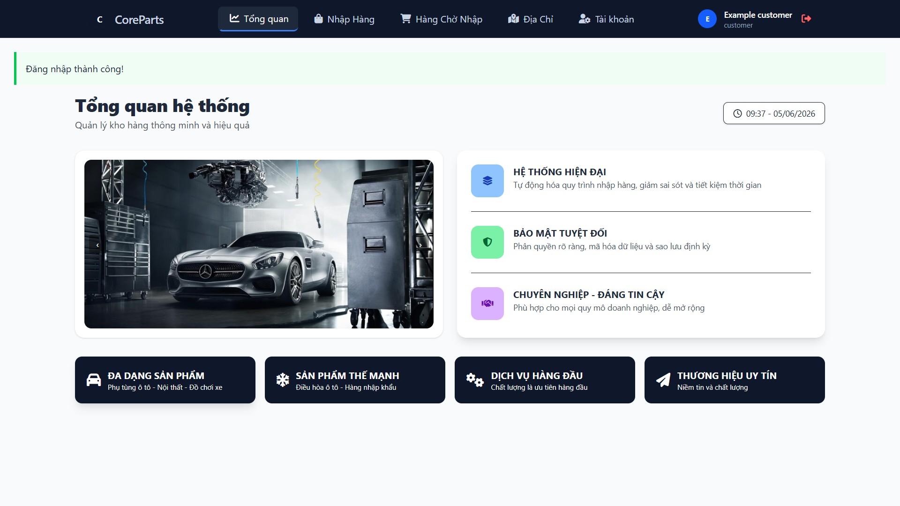
</p>

---

## Overview

This project is a full-stack Warehouse Management System (WMS) designed to simulate real-world warehouse operations and inventory workflows.

The platform manages the complete inventory lifecycle from inbound receiving to outbound fulfillment while maintaining accurate stock visibility across multiple warehouses and storage locations.

Key warehouse concepts implemented in this project include:

- FIFO Inventory Allocation
- Batch / Lot Tracking
- Stock Reservation
- Multi-Warehouse Management
- Inventory Ledger
- Inventory Auditing
- Warehouse Transfer Management
- Expiry Date Monitoring
- Low Stock Alerting

---

# Database Design

The database consists of more than 30 relational tables supporting warehouse operations, inventory tracking, order processing, auditing, and reporting.

<p align="center">
  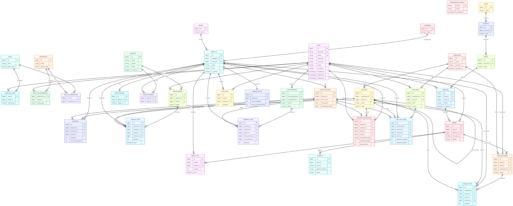
</p>

### Main Domains

| Domain | Description |
|----------|-------------|
| Products | Product catalog and batches |
| Warehouses | Warehouse management |
| Locations | Zone / Shelf / Rack / Bin hierarchy |
| Inventory | stock tracking |
| Inbound | Goods receiving |
| Outbound | Picking and shipping |
| Transfers | Warehouse transfers |
| Stock Takes | Inventory auditing |
| Transactions | Inventory ledger |
| Alerts | Expiry and low stock monitoring |

---

# Core Modules

## Warehouse Management

Manage multiple warehouses and storage locations.

### Features

- Multi-warehouse support
- Hierarchical location structure
- Location priority management
- Circular reference prevention

<p align="center">
  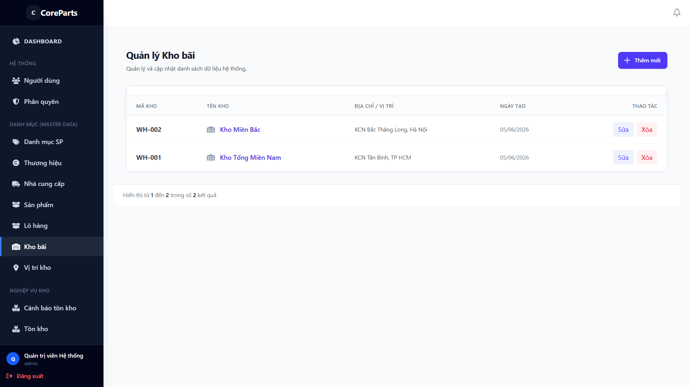
</p>

---

## Inventory Management

Real-time inventory visibility across warehouses.

### Features

- Stock availability tracking
- Reserved quantity tracking
- Batch-level inventory
- Inventory reconciliation

<p align="center">
  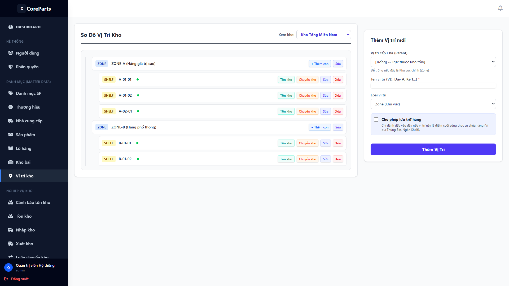
  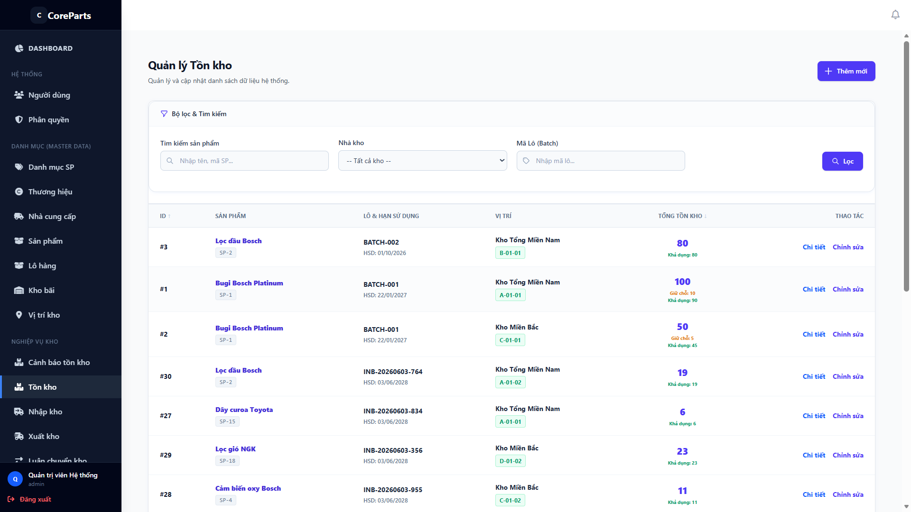
</p>

<p align="center">
  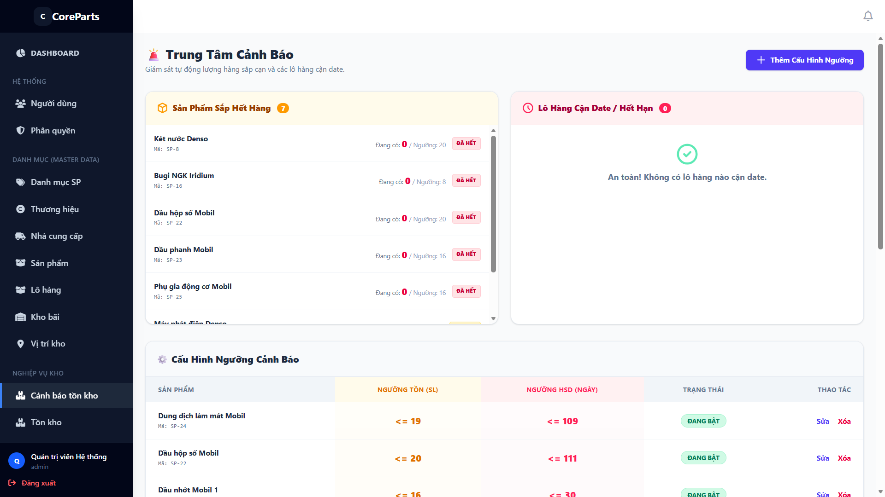
  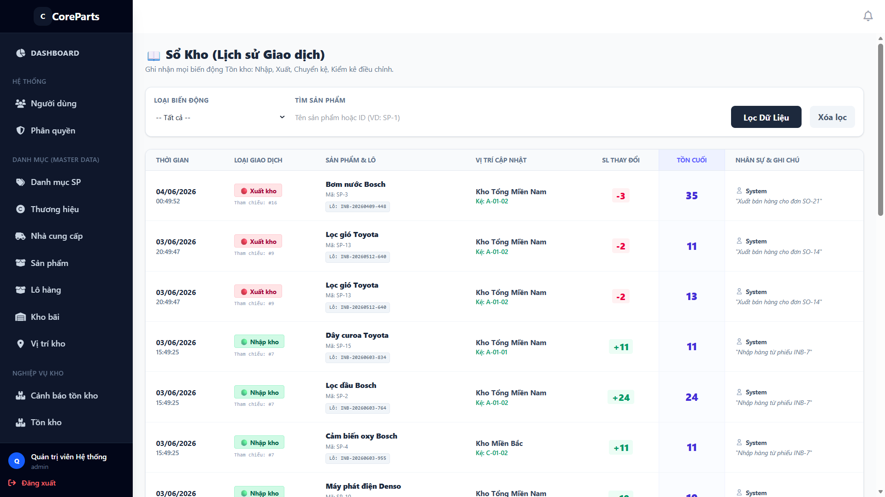
</p>

---

## Inbound Operations

Receive products from suppliers into warehouse locations.

### Features

- Receiving orders
- Batch creation
- Inventory updates
- Transaction logging

<p align="center">
  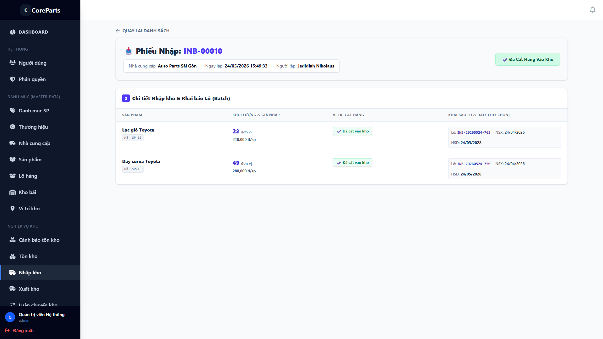
</p>

---

## Outbound Operations

Process inventory fulfillment requests.

### Features

- Picking workflow
- Packing workflow
- Inventory deduction
- FIFO allocation

<p align="center">
  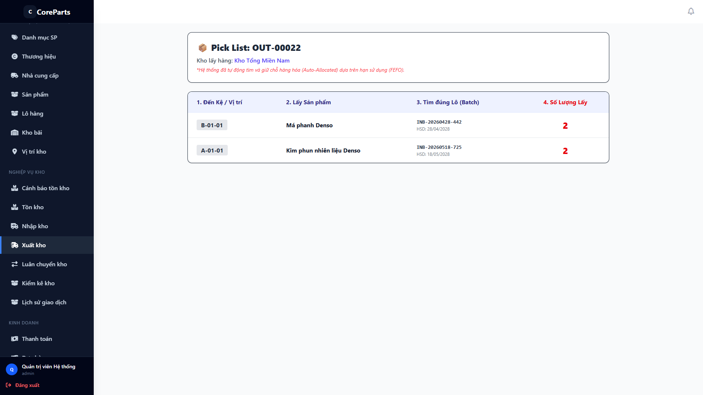
</p>

---

## Stock Transfer

Transfer inventory between warehouses and locations.

### Features

- Inter-warehouse transfers
- Internal location transfers
- Transfer tracking
- Transfer history

<p align="center">
  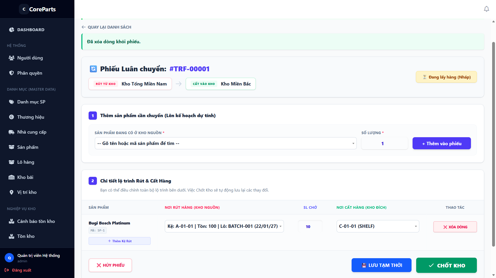
</p>

---

## Stock Take

Perform physical inventory counting and reconciliation.

### Features

- Stock count sessions
- Variance tracking
- Inventory adjustment
- Audit reporting

<p align="center">
  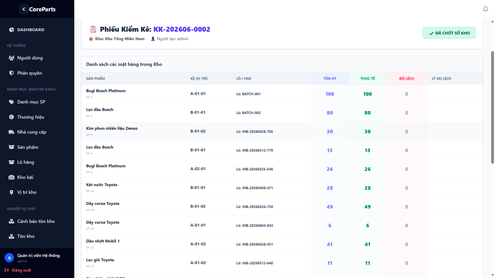
</p>

---

## Reporting & Analytics

Warehouse performance monitoring.

<p align="center">
  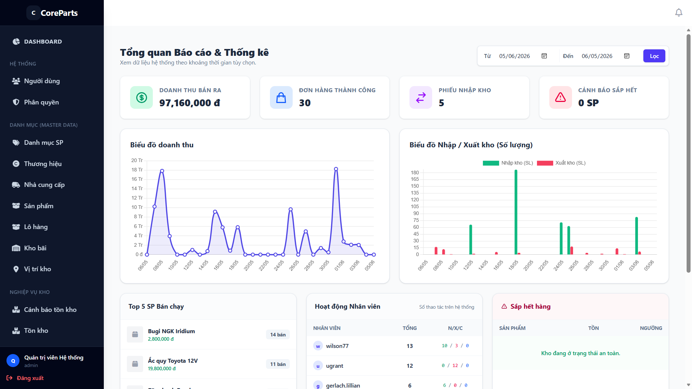
</p>

### Available Reports

- Inventory Summary
- Stock Movement
- Inbound Statistics
- Outbound Statistics
- Transfer Statistics
- Audit Reports

---

# Technology Stack

## Backend

- Laravel 11
- PHP 8.2
- PostgreSQL 16
- Eloquent ORM
- Laravel Scheduler
- Laravel Queue

## Frontend

- Blade
- Tailwind CSS
- JavaScript
- Vite
- Chart.js

## Security

- Authentication
- Authorization
- RBAC
- Spatie Permission

---

# Installation

## Requirements

- PHP >= 8.2
- PostgreSQL >= 16
- Composer
- Node.js >= 18
- NPM

---

## Clone Repository

```bash
git clone https://github.com/your-username/wms-project.git

cd wms-project
```

---

## Install Dependencies

```bash
composer install

npm install
```

---

## Environment Setup

```bash
cp .env.example .env

php artisan key:generate
```

Configure PostgreSQL connection:

```env
DB_CONNECTION=pgsql
DB_HOST=127.0.0.1
DB_PORT=5432
DB_DATABASE=wms_db
DB_USERNAME=postgres
DB_PASSWORD=postgres
```

---

## Database Setup

```bash
php artisan migrate:fresh --seed
```

---

## Run Application

Terminal 1

```bash
php artisan serve
```

Terminal 2

```bash
npm run dev
```

Application URL:

```text
http://127.0.0.1:8000
```

---

# Academic Information

This project was developed as a portfolio and learning project focusing on warehouse management system design, enterprise backend architecture, inventory control, and logistics operations.

Key learning outcomes:

- Database Design
- Warehouse Domain Modeling
- Inventory Algorithms
- Service Layer Architecture
- Repository Pattern
- RBAC Authorization
- Real-World Warehouse Workflows

---

# License

This project is developed for educational, portfolio, and research purposes.

---

<div align="center">

Built with ❤️ using Laravel, PostgreSQL and Tailwind CSS.

</div>
